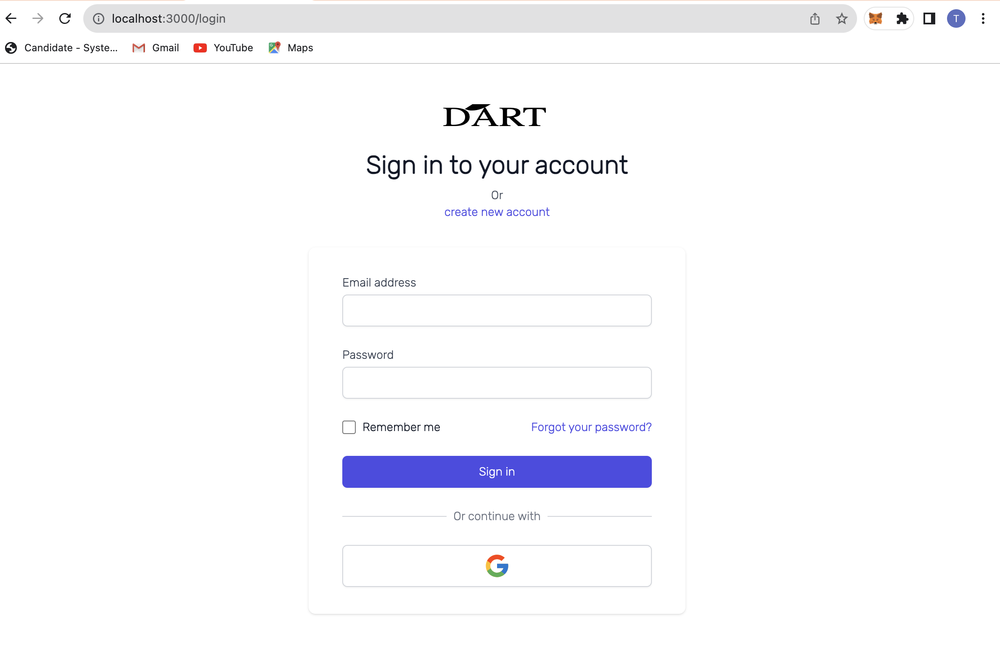
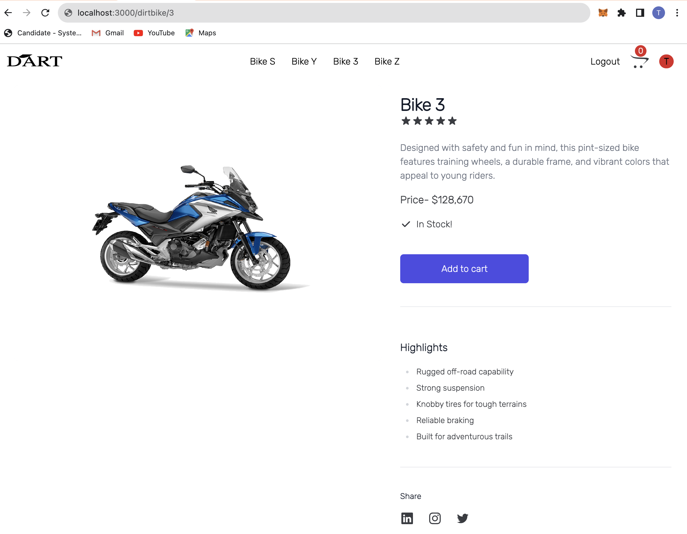

# Dart-MS

## Author
Noela Murugi<br>

## Description

## Project Features
* Home Page - Dart start section.
* Cart Page - View various items on your cart.
* Details Page - More details on specific dirt bike.
* Login page - Login to view your purchases progress.
* Checkout page - Make payments to items on cart.


## Sample Screenshots

### Home Page


### Login Page


### Add to Cart


## Technologies Used
+ Typescript<br>
+ CSS<br>
+ JavaScript<br>
+ React Redux<br>


## Setup instructions
Clone the repository
```
git clone git@github.com:Noela-Murugi/Dart-MS.git
```
Install dependecies
```sh
bundle install
rails db:create
npm install --prefix client
```

You can use the following commands to run the application:
```
Backend
rails s
Frontend
npm start --prefix client
```
+ Run the Frontend on: http://localhost:4000 <br>
+ Run the Backend on: http://localhost:3000/new <br>

## Contributions
1. Fork this repository.
2. Create a branch: `git checkout -b <branch_name>`.
3. Make your changes and commit them: `git commit -m '<commit_message>'`
4. Push to the original branch: `git push origin <project_name>/<location>`
5. Create the pull request.


## Live Page


## Contact Informantion
Incase of any enquiries or contributions, be sure to email me at :
noelatrixie@gmail.com

## License
MIT Licence<br>
Copyright (c) 2023 Dart<br>
Permission is hereby granted, free of charge, to any person obtaining a copy
of this software and associated documentation files (the "Software"), to deal
in the Software without restriction, including without limitation the rights
to use, copy, modify, merge, publish, distribute, sublicense, and/or sell
ccopies of the Software, and to permit persons to whom the Software is
furnished to do so, subject to the following conditions:
The above copyright notice and this permission notice shall be included in all
copies or substantial portions of the Software.
THE SOFTWARE IS PROVIDED "AS IS", WITHOUT WARRANTY OF ANY KIND, EXPRESS OR
IMPLIED, INCLUDING BUT NOT LIMITED TO THE WARRANTIES OF MERCHANTABILITY,
FITNESS FOR A PARTICULAR PURPOSE AND NONINFRINGEMENT. IN NO EVENT SHALL THE
AUTHORS OR COPYRIGHT HOLDERS BE LIABLE FOR ANY CLAIM, DAMAGES OR OTHER
LIABILITY, WHETHER IN AN ACTION OF CONTRACT, TORT OR OTHERWISE, ARISING FROM,
OUT OF OR IN CONNECTION WITH THE SOFTWARE OR THE USE OR OTHER DEALINGS IN THE
SOFTWARE.
